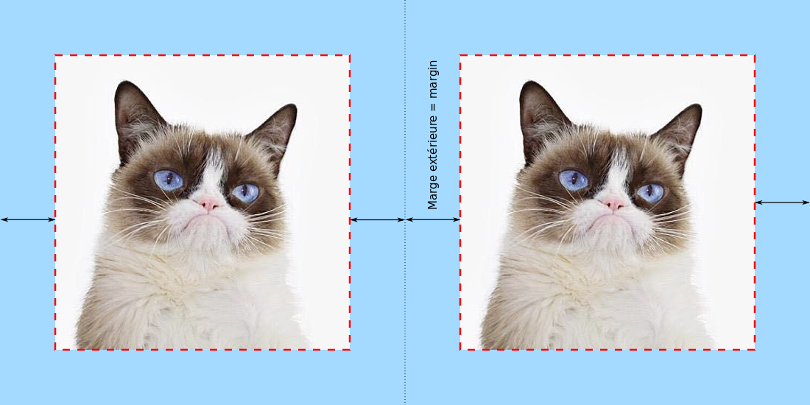
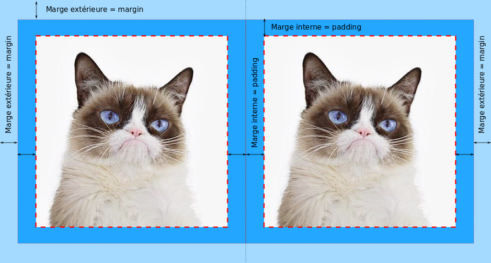
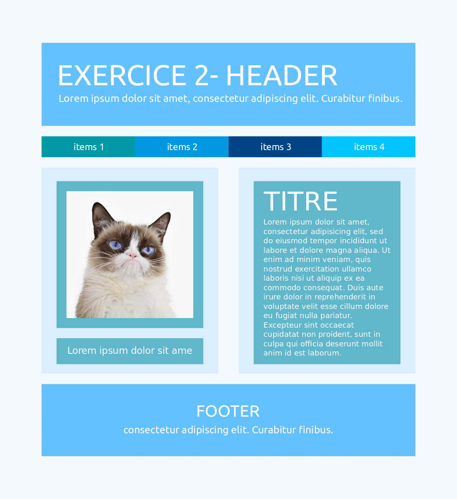
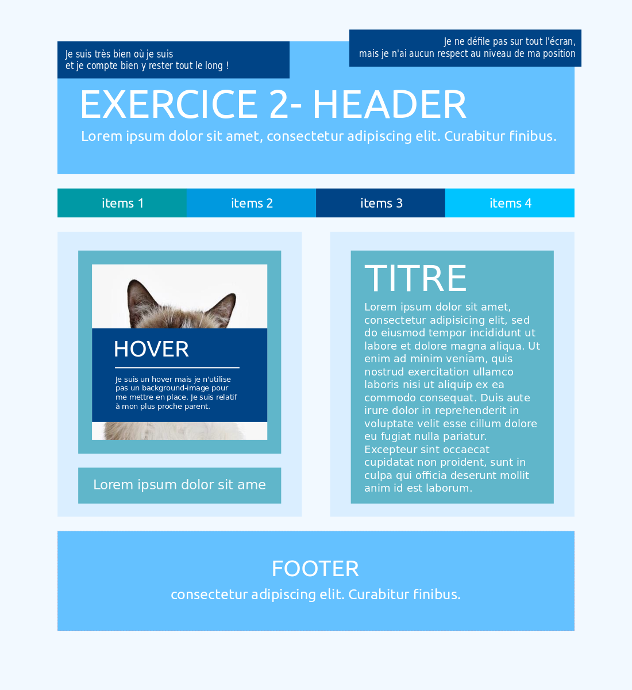
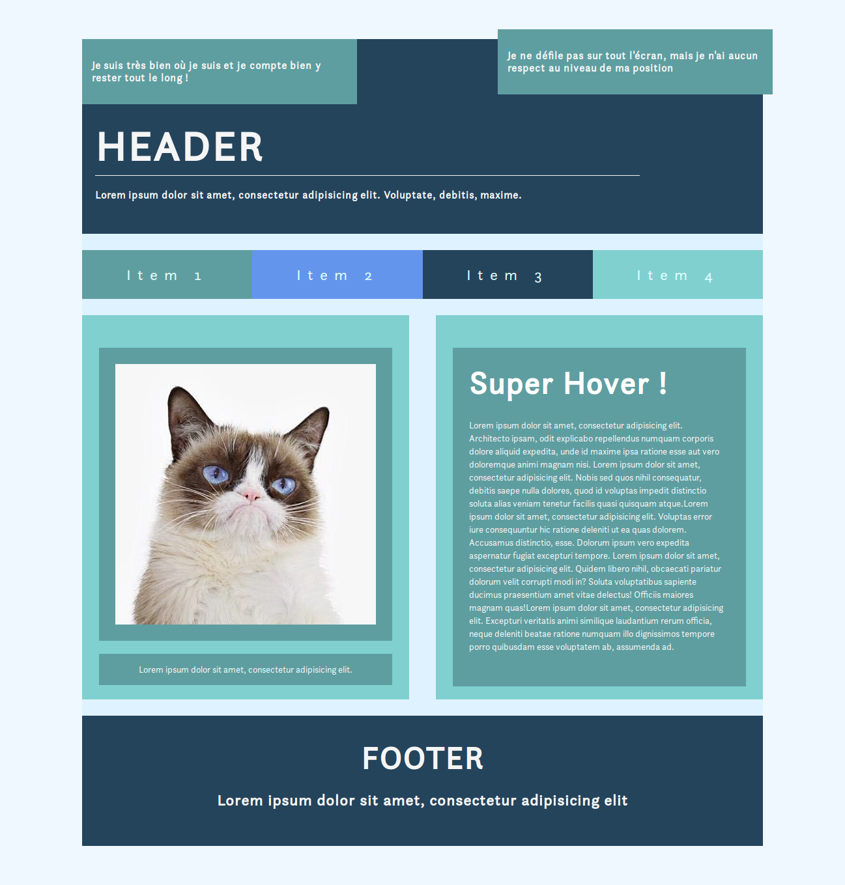

## On révise les bases en CSS !

#### Les marges en CSS
<!-- LES MARGES EXTÉRIEURES DÉFINITION -->
> ##### Les marges extérieures 
> Les marges intérieures permettent de définir la taille des marges autour d'un élément. Ainsi, on peut réaliser une séparation entre différents éléments.

> 
> (le fond bleu est votre body)

<!-- LES MARGES INTÉRIEURES DÉFINITION -->
> ##### Les marges intérieures
> Les marges intérieures permettent de définir la taille des marges encadrant un élément sans pour autant interagir sur les blocs l'entourant. Ainsi, on peut réaliser une marge sans pousser les éléments autour, pratique pour aligner des éléments proprement.

> 
> (le fond bleu est votre body)

<!-- EXERCICE 1 -->
> #### Exercice 1
> Reproduisez la maquette ci-dessous en gérant vos marges internes et externes !

> 

#### Les positions en CSS
<!-- POSITION FIXE -->
> ##### Les positions en CSS
> Les positions sont complexes à maîtriser mais aussi à expliquer. Ce site vous expliquera parfaitement comment cela fonctionne ! :D

>

<!-- EXERCICE 2 -->
> #### Exercice 2
> Attention vous repartez du même code mais des changements se sont glissés, c'est ça un client ! 3:)

> 

#### Typographie en CSS
<!-- La typographie en CSS -->
>##### Font family
> * Indique la police de caractères (les plus courantes sont : verdana, arial, helvetica,'Times New Roman').
    Exemple : font-family: 'Times New Roman', Times, serif;

>##### Font Size
> * Indique la taille de la police.
    Exemple : font-size: 2em;
    
>##### Couleur
> * Indique la couleur de la police.
    Exemple : color: red;
    
>##### Font Style
> * Indique l'orientation de la police.
    Exemple : font-style: italic;
    
>##### Font Weight
> * Indique la graisse de la police, c'est-à-dire l'épaissseur des traits de la police.
    Exemple : font-weight: bold;
    
>##### Font Variant
> * Permet l'affichage en petites capitales.
    Exemple : font-variant: small-caps;
    
>##### Text Decoration
> * Indique le soulignement, le surlignement ou le texte barré.
    Exemple : text-decoration: underline;
    
>##### Line Height
> * Indique l'interlignage, l'espacement entre les lignes de texte.
    Exemple : line-height: 0.9em;
    
>##### Line Height
> * Indique l'interlignage, l'espacement entre les lignes de texte.
    Exemple : line-height: 0.9em;
    
>##### Line Spacing
> * Indique l'interlettrage, l'espacement entre les caractères.
    Exemple : letter-spacing: 0.9em;
    
>##### Text Align
> * Indique l'alignement du texte.
    Exemple : text-align: center;
    
>##### Font Face
> * Intègre une typographie personnelle et dans notre dossier.
    Exemple : 
<pre>
@font-face {
        font-family: "Bitstream Vera Serif Bold";
        src: url("/static/styles/libs/font-awesome/fonts/fontawesome-webfont.fdf491ce5ff5.woff");  
}
</pre>    
    
<!-- EXERCICE 3 -->
> #### Exercice 3
> Partez pas en vrille, cette une capture d'image de ma page html, vous pouvez repartir de votre code en vous focalisant uniquement sur la gestion des typographies ! 3:)

> 